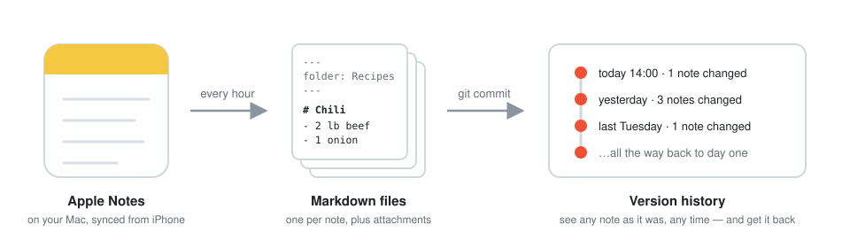
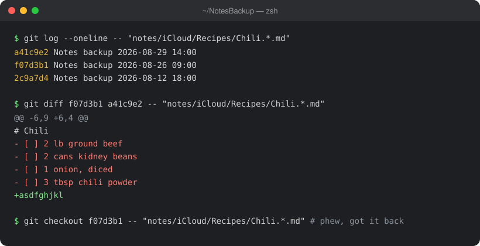

# Notes Backup for iOS Notes.app

**A barebones Time Machine, just for Apple Notes.** Every hour, your notes are saved to a local
git repo so you can see what any note looked like yesterday, last week, or last
month (and get it back).

<picture>
  <source media="(prefers-color-scheme: dark)" srcset="docs/how-it-works-dark.svg">
  
</picture>

## Why

Apple Notes has no version history. Yes, if you accidentally delete a note,
you can restore it. But if you *mangle* a note — paste over it, lose half of it
to a bad sync, let a toddler "edit" all your notes... Your note is just gone.

This tool fixes that. A quiet background job exports every note to a plain
Markdown file and commits it to git, so every note gets a full history and a
one-command rollback. Your iPhone needs nothing: if your notes sync via iCloud,
they're already on your Mac, and that's what gets backed up.

---

## Install (the easy way)

Installing involves a Python environment, a launchd job, and granting
**Full Disk Access** to exactly the right binary — doable, but fiddly. Instead,
let [Claude Code](https://claude.com/claude-code) or
[Codex](https://openai.com/codex) do it.

Open Claude Code / Codex and paste this in as your message:

```
Can we install this Apple Notes backup tool: https://github.com/texjer/notes-backup
```

The agent will clone the repo, run the installer, and walk you through the one
step it can't do for you: granting Full Disk Access in System Settings (macOS
requires this to read the Notes database). After that, backups run hourly and
at login, automatically.

## Install (manual)

```sh
git clone https://github.com/texjer/notes-backup.git
cd notes-backup
./install.sh
```

Then grant **Full Disk Access** to `.venv/bin/python3` — the installer opens
the right System Settings pane and prints the exact path to add.

---

## Getting a note back

It's all plain git, so any git tool works — or just ask your agent:
*"Show me what my Chili recipe note looked like last Tuesday."*



Notes live at `~/NotesBackup/notes/<Account>/<Folder>/<Title>.<uuid>.md`,
attachments at `~/NotesBackup/media/`. Copy the old text back into Notes and
you're done.

---

## Your notes stay on your Mac

This tool reads your notes, so you should know exactly where they go: **nowhere.**

- **No server, no account, no telemetry.** The backup script makes zero network
  requests — it's a few hundred lines of Python you can read yourself. The only
  time anything touches the internet is `pip install` during setup, to fetch
  the open-source parser library.
- **The backup is just a folder** at `~/NotesBackup`. It never gets pushed
  anywhere unless *you* add a git remote and push it.
- **Full Disk Access** is granted only to this project's own private Python
  binary, not your terminal or your whole shell — and you can revoke it in
  System Settings any time.

---

## Good to know

- **Settings** are in `~/.config/notes-backup/config.json` (backup location,
  snapshot retention, whether attachments go in git). The interval is set at
  install time: `NOTES_BACKUP_INTERVAL=1800 ./install.sh` (seconds).
- **Raw database snapshots** are kept in `~/NotesBackup/snapshots/` as a
  perfect-fidelity fallback — 6-hourly for 2 days, daily for a week, then
  monthly. Markdown captures text, checklists, and attachments; fancy
  formatting may be simplified.
- **Password-protected notes** can't be exported (a placeholder marks them).
- **The backup lives on your Mac.** For disaster protection, put
  `~/NotesBackup` somewhere that's itself backed up. If you push it to a git
  remote, make it private — it's your notes.
- Log: `~/Library/Logs/notes-backup.log`. Run by hand:
  `.venv/bin/python3 notes_backup.py`.

## Uninstall

```sh
./uninstall.sh   # removes the hourly job; never touches your backups
```

Or tell your agent: *"Uninstall notes-backup."*

## Credits

Built on [apple-notes-parser](https://github.com/RhetTbull/apple-notes-parser)
by Rhet Turnbull. [MIT](LICENSE).
